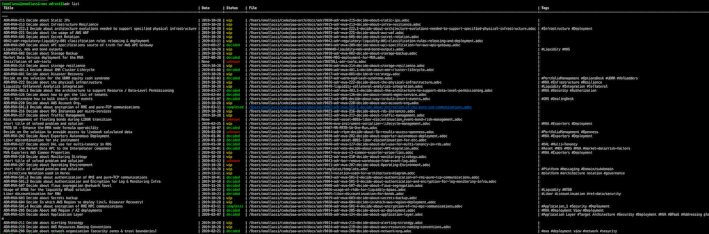

[](https://travis-ci.org/omallassi/adrust)  [](https://github.com/omallassi/adrust/workflows/Rust/badge.svg) [](https://coveralls.io/github/omallassi/adrust)

# ADRust: a CLI in Rust to manage (Architecture) Decision Records

The idea is to provide a cli to managed ADR. One more? yes...reality is that was mostly an excuse to play with `Rust`. 



Here are the main features: 
* [wip] Manage ADR lifecycle (create, obsoletes...). ADR should be written in _asciidoc_ (this is a long story...). Look at `./template` folder for more details. 
* [done] an `init` command
* [done] Support Tags
* [done] Support search across title, content and tags 
* [not started yet] Integrate with Git
* [not started yet] Support different types of templates
* [not started yet] Why not integrate with Microsoft Teams

## Supported OS and compiler
The current code line is developped on `MacOs / Rust 1.39` and build with `cargo` but [Travis CI](https://travis-ci.org/omallassi/adrust/builds) will build on `MacOs / Linux / Windows` on `Rust Stable Version` (cf. `.travis.yml` for details).

## Getting Started 

At this stage, the tool is not published on [crates.io](https://crates.io/). so `git clone` is for now your best friend. 

Once cloned, `cd` at the root of the cloned repo and run `cargo install --path cli` (the executable should be installed `$HOME/.cargo/bin/adr`)

Run `adr config list` to view the default configuration (and why not modify it) and `adr init` : directories specified in `config` should be created and a default template copied in `templates` sub-folder. 


## Play...

```
[omallassi@LEMON02 adrust]$./target/debug/adr -h
adr 0.1.0
A CLI to help you manage your ADR in git

USAGE:
    adr [SUBCOMMAND]

FLAGS:
    -h, --help       Prints help information
    -V, --version    Prints version information

SUBCOMMANDS:
    config    Manage Configuration Items
    help      Prints this message or the help of the given subcommand(s)
    init      Init ADRust based on config
    lf        Manage ADRs lifecycle
    list      Lists all Decision Records
    search    Search across all ADRs or build index
    tags      Manage Tags
```

In more details, 

| Command        | Description           |
| ------------- | ------------- |
| `adr init`      | certainly the first command to run (will create folders specified in `adr config` etc...) |
| `adr list`      | will list all the Decision Record, Title and Tags |
| `adr config list`     | will list the configuration. Configuration is stored in [config_dir](https://docs.rs/directories/2.0.2/directories/struct.ProjectDirs.html#method.config_dir)`/rs.adrust-tools.adrust-tools/` (so on MacOs `$HOME/Library/Preferences/rs.adrust-tools.adrust-tools/`)
| `adr config set --name prop --value val`      | will set the configuration property |
| `adr lf new --name "my decision"`      | will create a new decision  |
| `adr lf decided --path my-decision.md`      | will transition an ADR to decided |
| `adr lf superseded-by --path my-decision.md --by my-new-decision.md`      | will supersed an ADR `by` the specified one |
| `adr tags list`      | List all the tags whatever the Decision Record |
| `adr search --build-index`      | Build the index (not incrementally for now) in the folder defined in `adr config list`|
| `adr search --query "my search"`      | Search across indexed ADRs |

## ADR Template & lifecycle

For now, template should be in _asciidoc_. Look at `./templates/adr-temaplate-v0.1.adoc` (in particularly the header) for more details. 

The header of your ADR should be 
```
:docinfo1:
:wip: pass:quotes[[.label.wip]#In Progress#]
:decided: pass:q[[.label.decided]#Decided#]
:completed: pass:q[[.label.updated]#Completed By#]
:completes: pass:q[[.label.updated]#Completes#]
:supersedes: pass:q[[.label.updated]#Supersedes#]
:superseded: pass:q[[.label.obsoleted]#Superseded By#]
:obsoleted: pass:q[[.label.obsoleted]#Obsolete#]

== ADR-the title

*Status:* {decided}  *Date:* 2019-10-28

```

* the `:wip:` are basically the supported states. You can change the labels (e.g. `In Progress etc...` ) but that's it. 
* the `*Status:* {...` is used to manage the lifecycle of the ADR
* the `*Date:* ...` is also used to update the date of transitions on an ADR. 

ADRs follow the below lifecycle

[](https://mermaid-js.github.io/mermaid-live-editor/#/edit/eyJjb2RlIjoic3RhdGVEaWFncmFtXG5cdFsqXSAtLT4gd2lwXG5cdHdpcCAtLT4gZGVjaWRlZFxuXHR3aXAgLS0-IGNhbmNlbGxlZFxuXG5cdGRlY2lkZWQgLS0-IGNhbmNlbGxlZFxuXHRkZWNpZGVkIC0tPiBjb21wbGV0ZWRcblx0ZGVjaWRlZCAtLT4gc3VwZXJzZWRlZFxuXHRcblx0Y29tcGxldGVkIC0tPiBzdXBlcnNlZGVkXG5cdGNvbXBsZXRlZCAtLT4gY2FuY2VsbGVkXG5cblx0c3VwZXJzZWRlZCAtLT4gY2FuY2VsbGVkXG5cdGNhbmNlbGxlZCAtLT4gWypdIiwibWVybWFpZCI6eyJ0aGVtZSI6ImRlZmF1bHQifSwidXBkYXRlRWRpdG9yIjpmYWxzZX0)


## Tags
There is a beta support for tags. These tags, if available, will be used in `adr list` and `adr tags ...`

You can specify your tags directly (and anywhere) into the `.adoc` document, the following way
```
[tags]#deployment view# [tags]#network# [tags]#security#
```

It has nothing to do with `adrust` but you can also enrich your `Asciidoctor CSS` with a style for your `tags`. For instance: 
```
.tags {
    color: #fff;
    padding: .1em .5em .2em;
    font-weight: 500;
    border-radius: .25em;
    font-size: 90%;
    background-color: #aaa6a6;
}
```

## Log 
`adr config list` will show the [Level](https://docs.rs/slog/2.5.2/slog/enum.Level.html#method.as_usize) as defined in [slog](https://docs.rs/slog/2.5.2/slog/). 
To set the log level to Debug `adr config set --name log_level --value 6`

## Search
Search is based on [Tantivy Search](https://github.com/tantivy-search/tantivy). You can build your local index via `adr index --build` and search via `adr search --query "word#1 AND word#2"`

## Trouleshoot

* it may happen that `config`object evolves between commits and create issues. The usual symptoms are to get a `panic`when running `adr config list`or `adr init`, specifying that property `adr_....`cannot be found. In this case, the easiest is to run `rm $HOME/Library/Preferences/rs.adrust-tools.adrust-tools/adrust-tools.toml`. This will yet fallback to default values...
